# Titanic Dataset Analysis in R

## Overview
This project analyzes the Titanic passenger dataset to explore factors influencing survival rates during the disaster. Using R's data wrangling capabilities, I analysed the relationships between survival and variables like passenger class, gender, age, port of embarkation, and fare.

> **For more elaborate context guidance on data wrangling techniques, get my article on medium**: [R for Data Science: Data Wrangling]

## Disclaimer
The analysis and visualizations presented in this article are based on a simplified version of the Titanic dataset and are intended for educational and illustrative purposes only. The numbers and patterns presented do not necessarily reflect the actual number of passengers, incidents, or survival rates of the RMS Titanic. The dataset used has been modified and simplified for the purpose of this analysis, and any conclusions drawn should not be taken as historically accurate. This article is meant to demonstrate data analysis and visualization techniques, rather than provide a definitive account of the Titanic's history.

## Dataset Information
The analysis uses the `titanic_ds.xls` dataset containing:
- Passenger demographics (age, gender)
- Travel information (class, fare, embarkation port)
- Family relationships (siblings/spouses, parents/children)
- Destination information
- Survival status

## Required Libraries
```r
library(readxl)      # For reading Excel files
library(Amelia)      # For visualizing missing data
library(tidyverse)   # For data manipulation and visualization
library(knitr)       # For table formatting
```

## Analysis Workflow

### Data Loading
The analysis begins by loading the Titanic dataset from an Excel file and examining its structure:
```r
titanic_ds <- read_excel("titanic_ds.xls")
str(titanic_ds)
```

### Data Cleaning & Transformation
The data cleaning process includes:

#### Visualizing missing values:
```r
missmap(titanic_ds, col = c("red", "green"))
```

#### Selecting relevant variables:
```r
selected_titanic <- titanic_ds %>%
  select(age, pclass, sex, survived, embarked, home.dest, fare, parch, sibsp)
```

#### Creating new variables:
- Family size (combining siblings/spouses, parents/children)
- Fare categories (Lowest, Lower Middle, Upper Middle, Higher, Highest)

#### Transforming variables:
- Converting survived from numeric (0/1) to categorical (No/Yes)
- Categorizing age as "Adult" or "Child"
- Converting passenger class from numeric to descriptive (1st, 2nd, 3rd)
- Converting embarkation codes to port names (Cherbourg, Queenstown, Southampton)

#### Renaming variables for clarity and standardizing case
#### Removing rows with missing values

### Univariate Analysis
The analysis examines the distribution of:
- Fare categories
- Gender
- Age groups (adult/child)
- Ports of embarkation
- Passenger classes
- Survival rates
- Home destinations

All distributions are visualized using appropriate charts (pie charts, bar charts).

### Bivariate Analysis
The analysis explores relationships between survival rates and:
- Fare categories
- Gender
- Age
- Passenger class
- Port of embarkation

Stacked and side-by-side bar charts visualize these relationships.

## Key Visualizations

### Demographics
**1. Gender Distribution**  
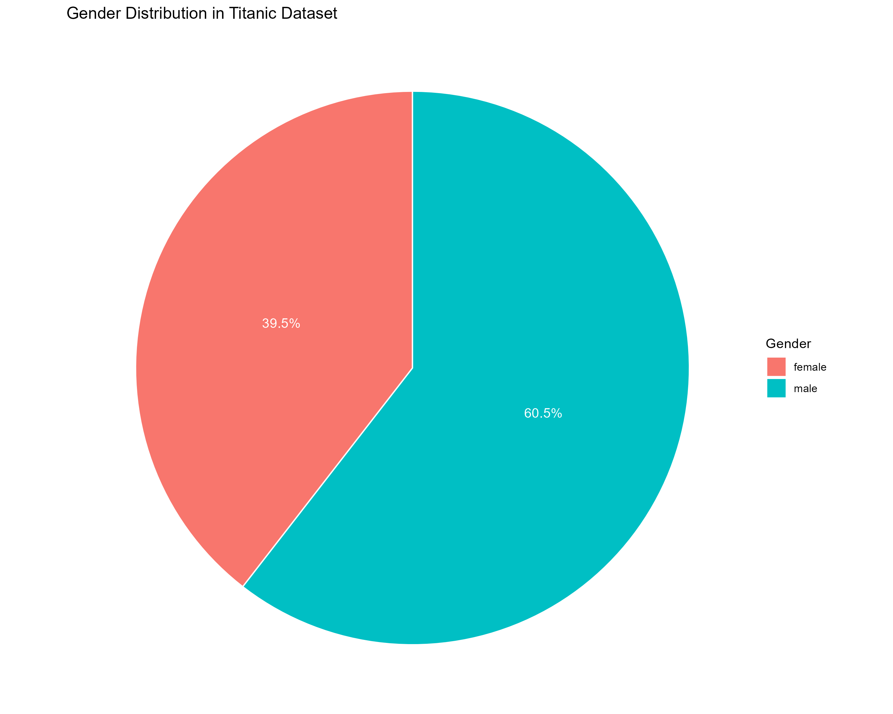  
*Gender distribution shows that males (60.5%) outnumbered females (39.5%) among Titanic passengers*

**2. Port of Embarkation**  
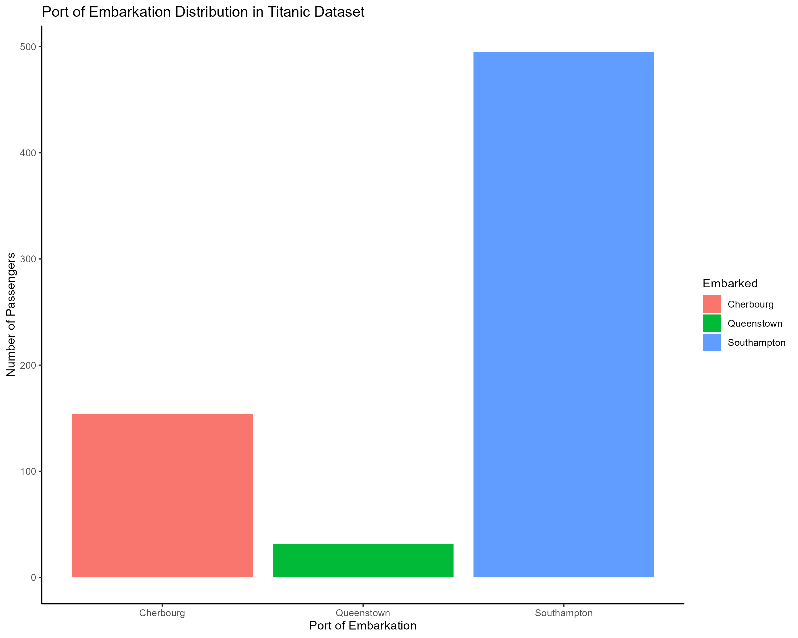  
*The majority of passengers embarked from Southampton*

**3. Class Distribution**  
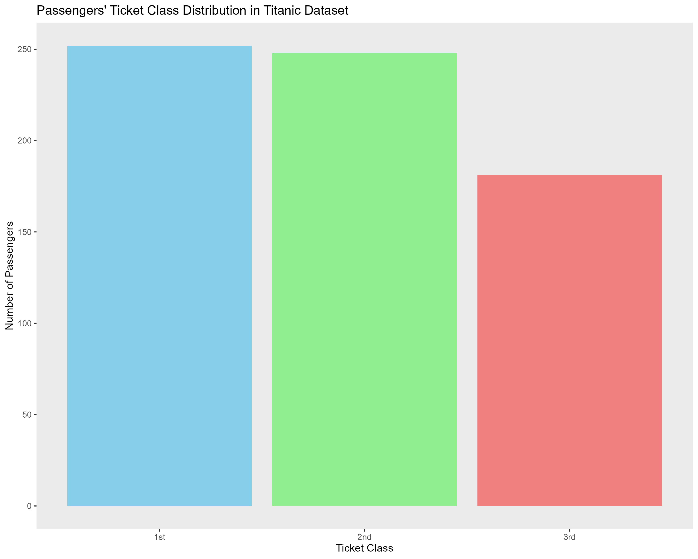  
*Distribution of passengers across ticket classes*

**4. Fare Distribution**  
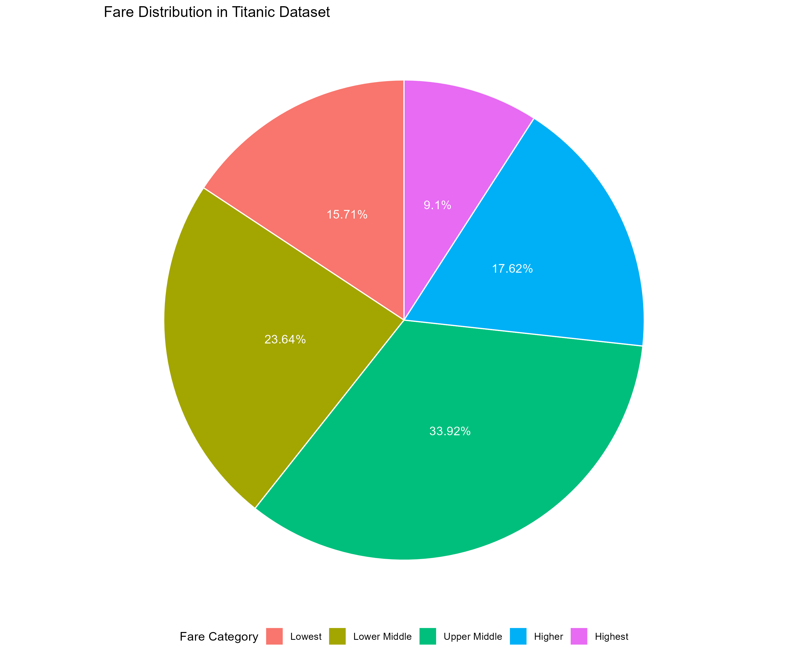  
*Fare category distribution shows most passengers paid in the Upper Middle range*

### Survival Patterns
**5. Overall Survival**  
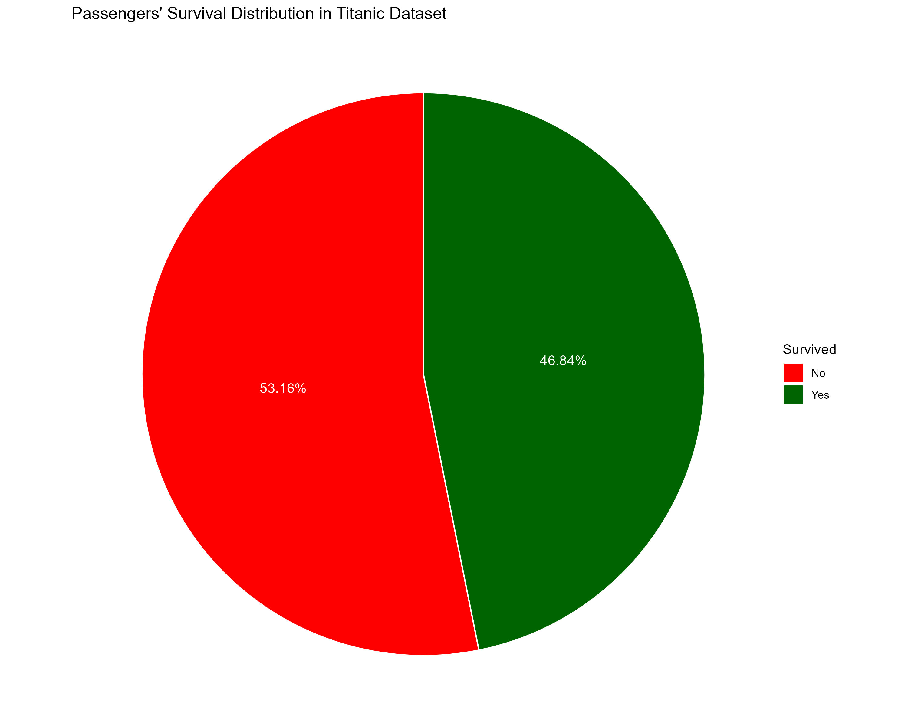  
*Overall survival rate shows 46.84% of passengers survived while 53.16% did not*

**6. Survival by Gender**  
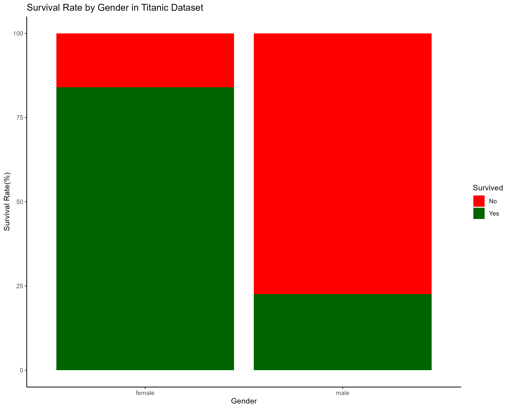  
*Women had a significantly higher survival rate (~74%) compared to men (~19%)*

**7. Survival by Class**  
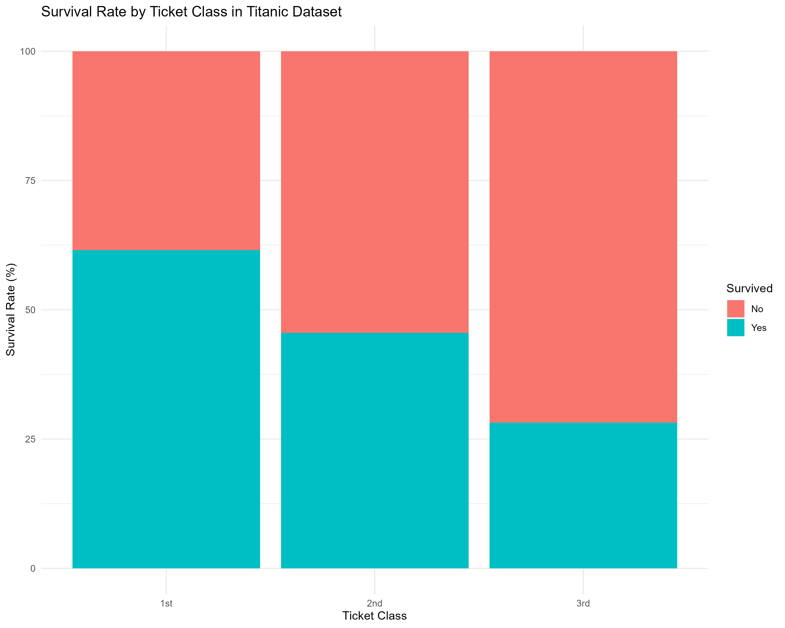  
*First-class passengers had the highest survival rate, followed by second and third class*

**8. Survival by Age**  
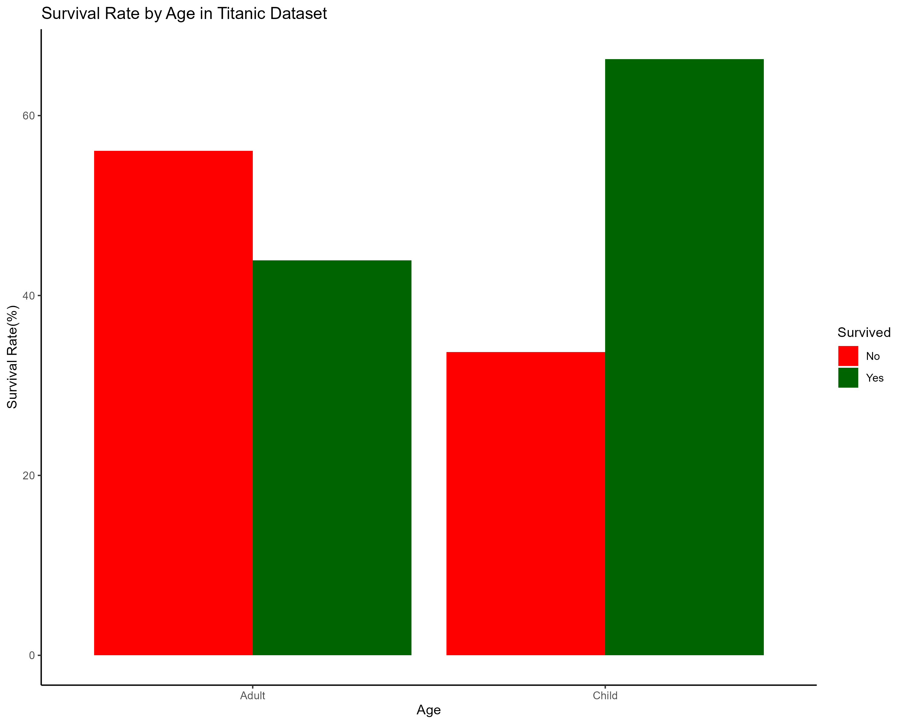  
*Children had higher survival rates compared to adults*

**9. Survival by Port**  
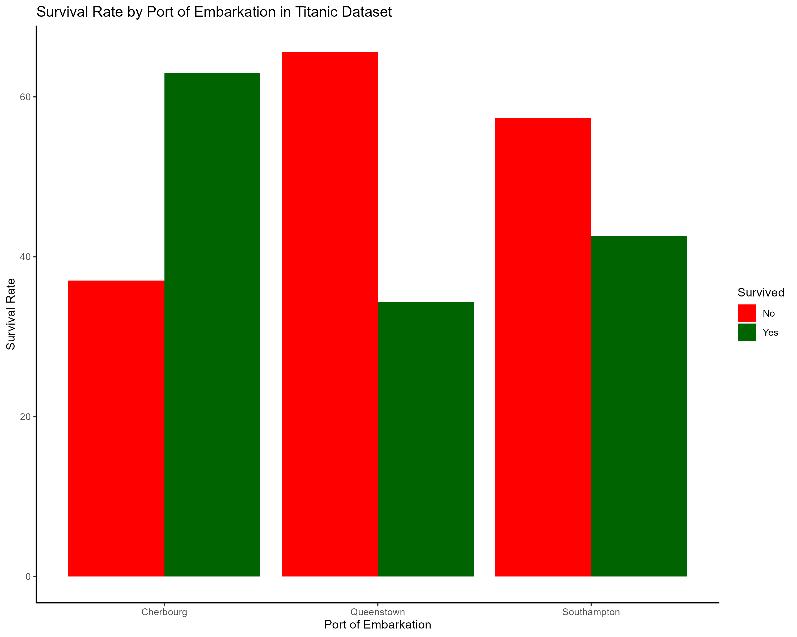  
*Passengers who embarked from Cherbourg had better survival rates*

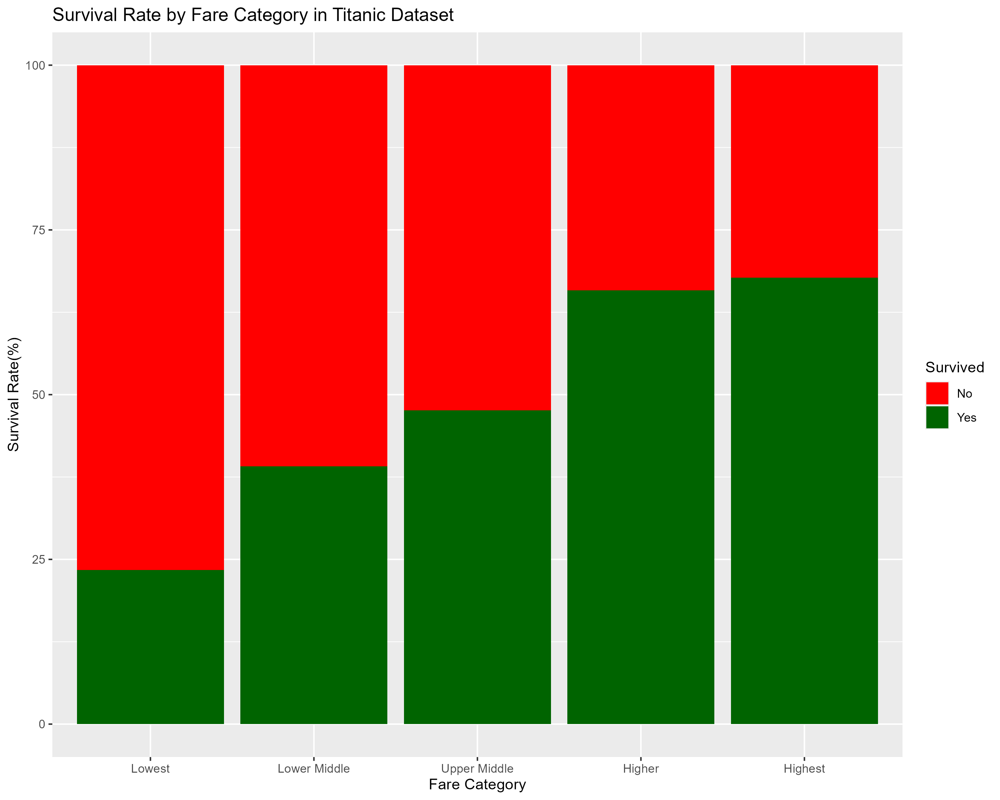
*Higher fare-paying passengers were more likely to survive*

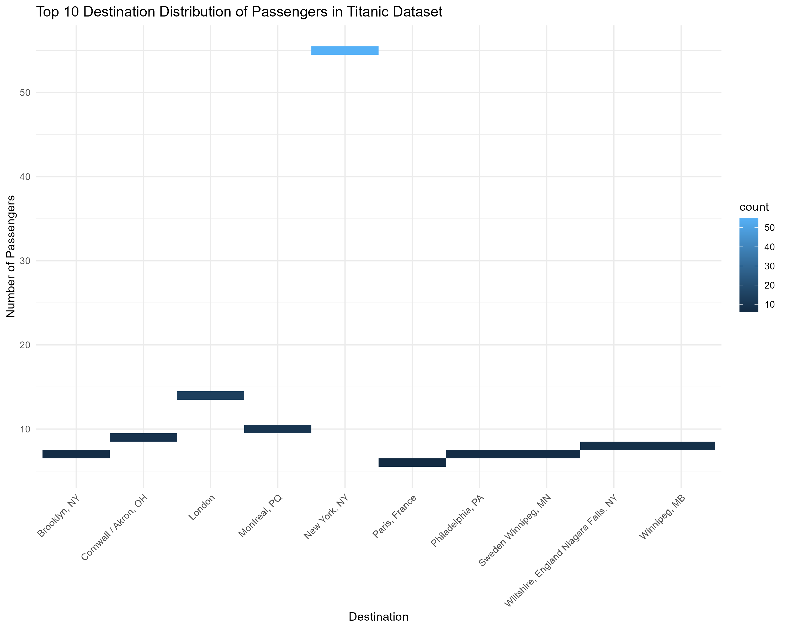
*Distribution of the top 10 destinations of Titanic passengers*


### Survival Patterns
- `Survival_distribution_titanic.png` - Overall survival rate pie chart
- `Survival_byfare_titanic.png` - Fare category influence on survival
- `Survival_bygender_titanic.png` - Gender influence on survival
- `Survival_byage_titanic.png` - Age influence on survival
- `Survival_byclass_titanic.png` - Class influence on survival
- `Survival_byport_titanic.png` - Embarkation port influence on survival

## Findings
The analysis reveals several key patterns in Titanic survival rates:

- **Class Impact**: First-class passengers had significantly higher survival rates than those in third class
- **Gender Disparity**: Women had much higher survival rates than men, reflecting the "women and children first" policy
- **Age Factor**: Children had better survival chances compared to adults
- **Fare Correlation**: Higher fare-paying passengers were more likely to survive
- **Embarkation Effect**: Passengers who embarked from Cherbourg had better survival rates

## Running the Code
To run this analysis:

1. Ensure all required packages are installed:
```r
install.packages(c("readxl", "Amelia", "tidyverse", "knitr"))
```

2. Place the `titanic_ds.xls` file in your working directory
3. Run the R script in RStudio or from the R console
4. Visualizations will be saved as PNG files in your working directory

## Project Structure
```
├── data/           # Contains titanic_ds.xls dataset
├── script/        # R analysis script
├── plots/          # Generated visualizations

```

## File Organization
- Dataset: `data/titanic_ds.xls`
- Analysis script: `script/titanic_analysis.R`
- Visualizations are saved to `plots/`

---
*Note: This analysis is for educational purposes. Please double-check all results.*